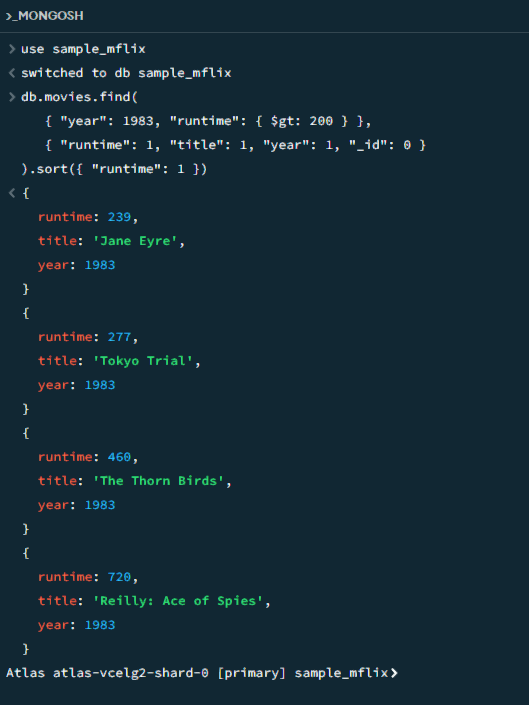
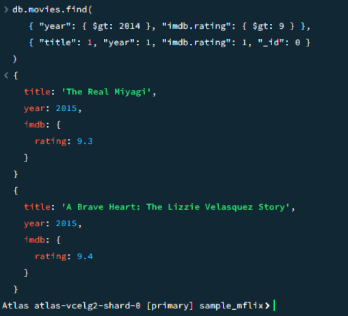

# CS:3980:0001
# Cade Anderson
# Assignment-3-MongoDB

# Query 1
db.movies.find(
   { "year": 1983, "runtime": { $gt: 200 } },
   { "runtime": 1, "title": 1, "year": 1, "_id": 0 }
).sort({ "runtime": 1 })

## Screenshot for Query 1

# Query 2
db.movies.find(
   { "year": { $gt: 2014 }, "imdb.rating": { $gt: 9 } },
   { "title": 1, "year": 1, "imdb.rating": 1, "_id": 0 }
)

## Screenshot for Query 2

